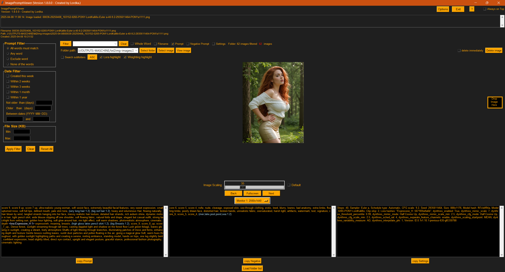
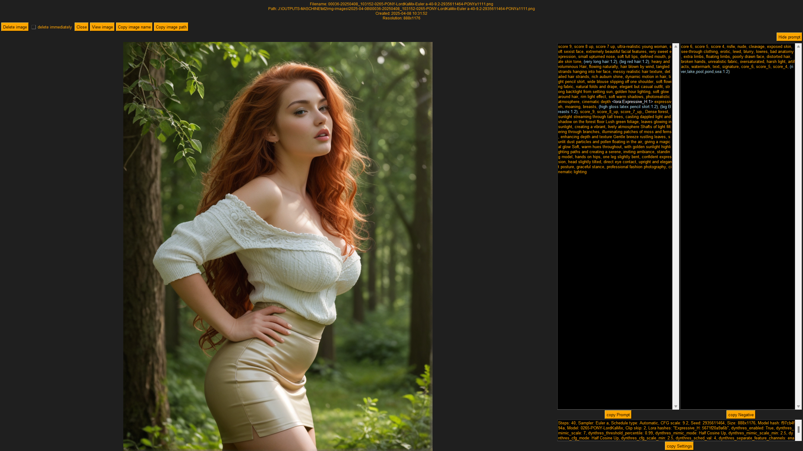
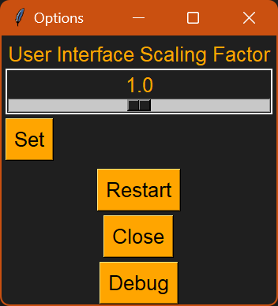

---

## ✅ Saubere, fertige `README.md` für dein Projekt **ImagePromptViewer**

```markdown
# 🖼️ ImagePromptViewer

**Version:** 1.8.0.0  
**Release Date:** 2025-04-08  
**Codename:** Master9 Stable  
**Author:** [LordKa-Berlin](https://github.com/LordKa-Berlin)  
**License:** CC BY-NC 4.0  

---

## 🔍 What is ImagePromptViewer?

**ImagePromptViewer** is a lightweight, powerful image viewer tailored for AI-generated images with embedded **prompt metadata**.  
It reads and displays hidden prompts and generation settings inside PNG and JPEG files, especially those created using tools like **AUTOMATIC1111**, **Stable Diffusion**, or **Forge**.

Whether you’re curating datasets, reviewing generations, or digging into prompt structures – this tool brings your images and their embedded intelligence to life.

---

## ✨ Key Features

- 🖼️ **Image Viewer** with adjustable thumbnail sizes
- 📥 **Reads embedded prompts** from PNG and JPEG
- 🧠 **Parses Prompt / Negative Prompt / Settings** separately
- 🗂️ **Folder & Subfolder navigation**
- 🔍 **Filter by keywords**, file size, date, and prompt content
- 🧾 **LoRA & weight highlighting** in prompt text
- 🖥️ **Fullscreen mode** with quick delete/copy options
- 🗑️ **Safe deletion** to Recycle Bin
- 🕘 **History** of recently opened folders

---

## 📷 Screenshots

### 🖼️ Main Window  


### 🖼️ Fullscreen Mode  


### 🖼️ UI Scaling  


---

## ⚙️ Installation & Usage

### Requirements

- **Python** 3.7 or higher
- OS: Windows, Linux, macOS

### Installation

```bash
pip install tkinterdnd2 Pillow screeninfo send2trash piexif
```

### Start the App

```bash
python ImagePromptViewer-1.8.0.0.py
```

---

## 🧪 Prompt Extraction Details

- **PNG**: Reads from `parameters`, `description`, `prompt`, or info dictionary
- **JPEG**: Extracts from `EXIF.UserComment` (supports common variants)
- **Extraction logic**: Stable Diffusion format aware (e.g. WebUI & Forge)

---

## 🧰 Advanced Features

### Filtering
- 🔤 Filter by **prompt content**, **file name**, or **settings**
- 📆 Filter by **date** or **file size**
- 👁️ Active filter indicator in GUI

### Fullscreen
- Prompts displayed over full image
- Supports: delete, copy path, scrollable text fields
- Ideal for reviewing generations in detail

---

## ⚠️ Known Limitations

- 📅 Date range filtering is still experimental
- 🖼️ Large folders (>4000 images) may affect performance
- 🔄 Some rare prompt formats may be unsupported (yet)

---

## 💬 Feedback & Contributions

Feel free to:

- 🐛 Report bugs via [GitHub Issues](https://github.com/LordKa-Berlin/ImagePromptViewer/issues)
- 📧 Send feature ideas or problematic files to **lordkaberlin@gmail.com**

---

## 📜 License

This project is licensed under the  
**Attribution-NonCommercial 4.0 International (CC BY-NC 4.0)**  
See [LICENSE.md](LICENSE.md) for full details.

---

_Developed with care by LordKa-Berlin — keeping prompt history alive._
```

---
