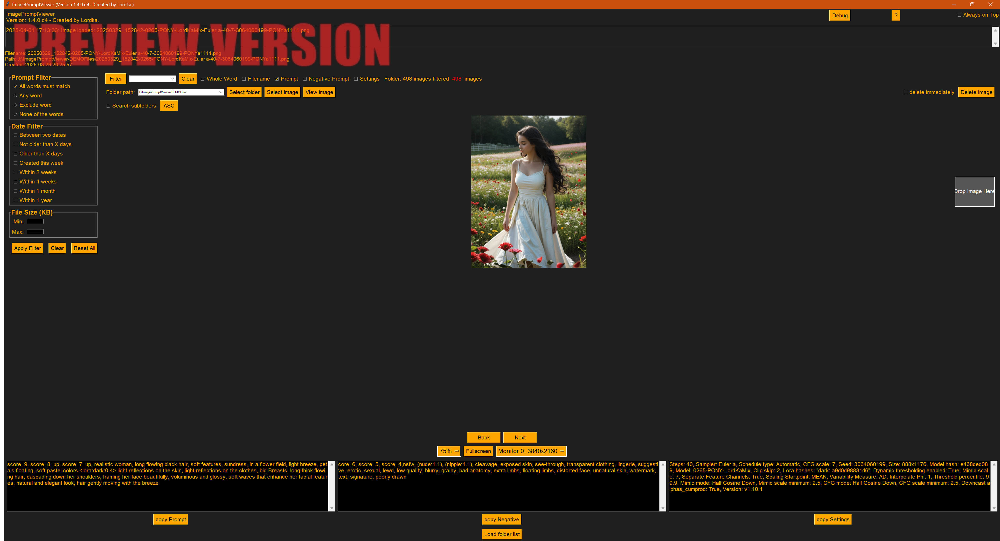

# ImagePromptViewer (Preview Version)

**Version**: 1.4.0.d4 (Development Branch: `entwicklung`)  
**Date**: 2025-04-01  
**Internal Designation**: Master8 Alpha10  
**Author**: LordKa-Berlin  

---

## Note: This is a Preview Version
This version of `ImagePromptViewer` is currently in the development branch `entwicklung` and represents a preview release. It is not yet fully stable or feature-complete. Some features are still in progress, and there are known limitations (see [Known Issues](#known-issues)). Feedback and bug reports are welcome!

---

## Overview
`ImagePromptViewer` is a Python-based tool for displaying and managing image files (PNG and JPEG). It extracts metadata from images—specifically text chunks such as Prompt, Negative Prompt, and Settings—and provides a user-friendly GUI with advanced filtering options. It was developed to efficiently analyze and organize AI-generated images (e.g., from Stable Diffusion).

### Main Features
- **Image Display**: Dynamic display of PNG and JPEG images with scalable previews.
- **Metadata Extraction**:
  - PNG: From `info['parameters']` or fallback keys (`prompt`, `metadata`, `description`).
  - JPEG: From EXIF tag 37510 (`UserComment`) with support for UNICODE decoding.
- **Filtering**: Advanced filter options for Prompt, Filename, Negative Prompt, Settings, File Date, and File Size.
- **Fullscreen Mode**: Display of the current image with metadata and control options.
- **Folder Management**: Supports loading folders and subfolders with history functionality.
- **Deletion**: Moves images to the recycle bin with an optional immediate delete feature.

---

## Screenshots

### 🖼️ Main Program Window


### 🖼️ Fullscreen Mode


---

## Installation

### Prerequisites
- **Python**: Version 3.7 or higher
- **Operating System**: Windows, macOS, or Linux

### Dependencies
The script automatically installs missing Python libraries. Required packages:
- `tkinterdnd2` (Drag-and-Drop)
- `Pillow` (Image Processing)
- `screeninfo` (Monitor Resolution)
- `send2trash` (Recycle Bin Functionality)
- `piexif` (EXIF Data Processing)

Install these manually with:
```bash
pip install tkinterdnd2 Pillow screeninfo send2trash piexif
```

### Running the Program
1. Clone the repository:
   ```bash
   git clone https://github.com/LordKa-Berlin/ImagePromptViewer.git
   cd ImagePromptViewer
   git checkout entwicklung
   ```
2. Run the script:
   ```bash
   python ImagePromptViewer-1.4.0.d4.py
   ```

---

## Features in Detail

### Image Display and Navigation
- **Main Window**: Displays the current image with scalable previews (25%, 50%, 75%, Default).
- **Navigation**: Arrow keys or mouse wheel to browse through images.
- **Preview List**: Toggleable list of all images in the folder with thumbnails.

### Metadata Extraction
- **PNG**: Extracts text from `info['parameters']` or fallback keys.
- **JPEG**: Reads EXIF tag `UserComment`, supports UNICODE decoding (UTF-16LE, Latin-1 fallback).
- **Text Splitting**: Divides the text into:
  - **Prompt**: Main image description.
  - **Negative Prompt**: Exclusion criteria.
  - **Settings**: Generation parameters (e.g., "Steps:").

### Filtering
- **Prompt Filter**:
  - Modes: "All words must match", "Any word", "Exclude word", "None of the words".
  - Supports "Whole Word" option.
- **File Filter**: Filtering by Filename, Negative Prompt, and Settings.
- **File Size**: Min/Max in KB.
- **Date Filter**: Options like "This week", "Within 2 weeks", etc. (see [Known Issues](#known-issues)).
- **Visual Feedback**: Filter button turns red when a filter is active.

### Fullscreen Mode
- **Display**: Large-scale image display with metadata.
- **Controls**: Copy filename/path, delete, show/hide prompt.
- **Navigation**: Arrow keys or mouse wheel.

### Folder Management
- **Folder Selection**: Via dialog or Drag-and-Drop.
- **Subfolders**: Optionally searchable.
- **History**: Stores the last 10 folders and filters.

### Deletion
- **Default**: Moves images to the recycle bin with confirmation.
- **Immediate Delete**: Without confirmation (button turns red).

---

## User Interface
- **Color Scheme**:
  - Background: Dark Gray (`#1F1F1F`)
  - Buttons: Orange (`#FFA500`)
  - Text: Orange (`#FFA500`) on Black (`#000000`)
- **Layout**:
  - Left: Filter Settings Panel (Prompt, Date, File Size).
  - Right: Image display, control elements, and metadata fields.
- **Dynamic Sizing**: Adjusts to 90% of the monitor resolution.

---

## Known Issues
- **Filter Functions**:
  - Not all date filters (e.g., "Between two dates", "Not older than X days") are fully functional yet. These are currently being implemented.
- **Large Folders**: Folders or subfolders with more than 4000 image files may cause performance issues or crashes. Optimization is in progress.
- **Stability**: As a preview version, unexpected errors may occur.

---

## Planned Improvements
- Full implementation of all date filters.
- Performance optimization for large folders (Lazy Loading, Multiprocessing).
- Error handling and stability improvements.
- Support for additional image formats (e.g., WebP).

---

## Usage
1. Start the program.
2. Select a folder via "Select folder" or drag an image via Drag-and-Drop.
3. Use the filter options in the left panel and the search field in the top right.
4. Browse through images and analyze metadata.
5. Delete images or copy information as needed.

---

### Changes in 1.4.0.d4
- Integration of Filter Settings into the main window (separate window removed).
- New filter panel on the left with Prompt, Date, and File Size filters.
- Removal of the old "Filter Settings" button.
- Retention of all other functions and layouts.

---

## Feedback
Since this is a preview version, we welcome feedback! Please create an [Issue](https://github.com/LordKa-Berlin/ImagePromptViewer/issues) or contact me directly.

---

*Developed by LordKa-Berlin, 2025*

